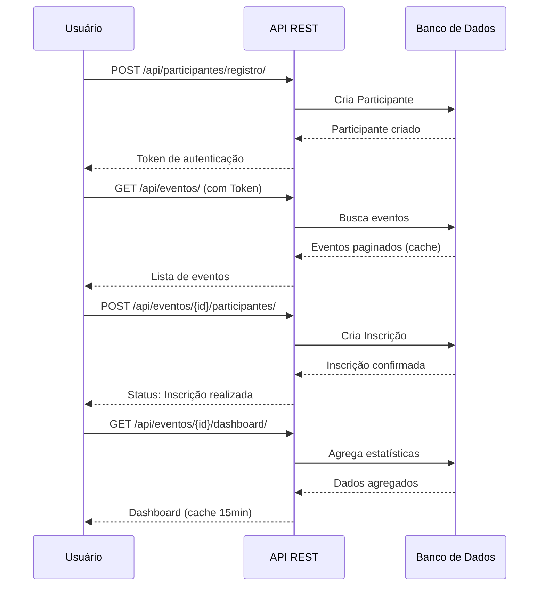

# 📅 API de Gestão de Eventos

[](https://www.python.org/)
[](https://www.djangoproject.com/)
[](https://www.django-rest-framework.org/)
[](https://opensource.org/licenses/MIT)

## 📖 Sobre o Projeto
Este sistema é uma API RESTful robusta para gerenciamento completo de eventos acadêmicos e corporativos. O projeto permite que organizadores criem eventos e atividades, enquanto participantes podem se inscrever e visualizar a programação.

O sistema conta com painel administrativo moderno (**Jazzmin**), documentação automática (**Spectacular**) e autenticação (**Token** para API). Suporta variáveis de ambiente via `decouple`, paginação customizada, cache, throttling (rate limiting), e exportação de relatórios em CSV.

---

## 🚀 Tecnologias Utilizadas

| Tecnologia | Finalidade |
| :--- | :--- |
| **Django** | Framework Web Principal |
| **Django REST Framework** | Criação da API e Serializers |
| **SQLite3** | Banco de dados (ambiente de desenvolvimento) |
| **Django Filter** | Filtros avançados de busca |
| **Jazzmin** | Interface administrativa moderna e responsiva |
| **Drf-Spectacular** | Documentação interativa (Swagger UI) |
| **Pillow** | Gerenciamento de imagens (Banners dos eventos) |
| **Django CORS Headers** | Configuração de CORS |
| **Django Safedelete** | Soft delete para modelos |
| **Python Decouple** | Gerenciamento de variáveis de ambiente |

---

## 📂 Estrutura do Projeto

```bash
gestao_eventos_teste/    # Raiz do Projeto
│
├── media/               # Uploads (Banners de eventos)
├── static/              # Arquivos estáticos (CSS, JS, imagens)
├── staticfiles/         # Arquivos estáticos coletados (produção)
├── logs/                # Logs da aplicação
├── core/                # App Principal
│   ├── templates/       # Templates HTML
│   │   └── index.html   # Landing Page
│   ├── models.py        # Modelos (Participante, Evento, Atividade, Inscrição)
│   ├── views.py         # ViewSets e Actions customizadas
│   ├── serializers.py   # Serializers para API
│   ├── urls.py          # Rotas da API
│   ├── permissions.py   # Permissões customizadas
│   ├── pagination.py    # Paginação customizada
│   ├── admin.py         # Configuração do Admin
│   └── tests.py         # Testes Automatizados
├── gestao_eventos/      # Configurações Django
│   ├── settings.py      # Configurações (Apps, DB, Auth, Cache, Logging)
│   └── urls.py          # Rotas Globais (Admin, API, Docs, Token)
├── .env                 # Variáveis de ambiente (SECRET_KEY, DEBUG, etc)
├── manage.py
└── requirements.txt
```

---

## 🗂️  Modelo de Dados (Entidades)
O banco de dados foi modelado para suportar relacionamentos complexos:

### 1. **Participante (User)**:
- Usuário customizado (herda de AbstractUser).
- Campos extras: celular, tipo (estudante, palestrante, organizador).

### 2. **Evento**:
- Entidade principal.
- Possui banner (imagem), datas, local e descrição.
- Relacionamento 1:N com Atividades.

### 3. **Atividade**:
- Sub-eventos (Workshops, Palestras).
- Possui um responsavel (Participante).

### **TimeStampedModel**: Modelo abstrato com campos `created_at` e `updated_at` para rastreamento de timestamps (utilitário opcional ainda não adotado pelas entidades)

### 4. **Inscrição**:
- Tabela associativa (N:N) entre Participante e Evento.
- Registra a data e evita inscrições duplicadas.
- Possui campo 'status' (pendente, confirmado, cancelado)

---

## ⚙️ Instalação e Configuração
Siga os passos abaixo para rodar o projeto localmente:

### 1. Configurar Ambiente
```bash
# Baixe o código-fonte do projeto
# Descompacte o arquivo e navegue até o diretório do projeto
cd gestao_eventos_teste

# Crie e ative o ambiente virtual
python -m venv venv
# Windows:
venv\Scripts\activate
# Linux/Mac:
source venv/bin/activate

```

### 2. Configurar Variáveis de Ambiente
```bash
# Crie um arquivo .env na raiz do projeto
# Adicione as seguintes variáveis:
SECRET_KEY=sua-chave-secreta-aqui
DEBUG=True
ALLOWED_HOSTS=localhost,127.0.0.1
CORS_ORIGINS=http://localhost:3000
```

### 3. Instalar Dependências
```bash
pip install -r requirements.txt
```

### 4. Banco de Dados e Usuário
```bash
# Crie a pasta logs se não existir: mkdir logs

# Cria as tabelas no banco SQLite
python manage.py makemigrations
python manage.py migrate

# Cria o administrador do sistema
python manage.py createsuperuser
# Defina usuário (ex: admin) e senha (ex: 123)
```

### 5. Rodar o Servidor
```bash
python manage.py runserver
```

---

## 🔌 Documentação da API
A documentação interativa é gerada automaticamente pelo Swagger. Acesse: http://127.0.0.1:8000/api/docs/

### Principais Endpoints
| Método | Rota                                      | Descrição                              | Auth |
| :----- | :---------------------------------------- | :------------------------------------- | :--- |
| POST   | /api/token/                               | Obtém Token de Acesso (Login)          | 🔓   |
| POST   | /api/participantes/registro/              | Registro público (retorna token)       | 🔓   |
| GET    | /api/participantes/                       | Lista participantes                    | 🔒   |
| GET    | /api/eventos/                             | Lista eventos (paginado, cache 15min)  | 🔓   |
| POST   | /api/eventos/                             | Cria novo evento                       | 🔒   |
| GET    | /api/eventos/{id}/                        | Detalhes do evento                     | 🔓   |
| GET    | /api/eventos/{id}/dashboard/              | Estatísticas do evento (cache 15min)   | 🔓   |
| POST   | /api/eventos/{id}/participantes/          | Inscrever-se no evento                 | 🔒   |
| GET    | /api/eventos/{id}/participantes/          | Lista participantes do evento          | 🔒   |
| GET    | /api/eventos/{id}/atividades/             | Lista atividades do evento             | 🔓   |
| POST   | /api/eventos/{id}/atividades/             | Cria atividade no evento               | 🔒   |
| GET    | /api/eventos/{id}/relatorio_participacao/ | Relatório de participação (JSON/CSV)   | 🔒   |
| GET    | /api/atividades/                          | Lista atividades (paginado, cache)     | 🔓   |
| GET    | /api/inscricoes/                          | Lista inscrições do usuário            | 🔒   |
| POST   | /api/inscricoes/                          | Cria inscrição                         | 🔒   |

**Paginação**: Todos os endpoints de listagem suportam paginação. Use `?page=2&tamanho=50` (máximo 100 por página)
**Filtros**: Eventos podem ser filtrados por `?local=`, `?search=` e ordenados por `?ordering=data_inicio`
**Atividades**: Filtráveis por `?tipo=` e `?evento=`
**Exportação CSV**: Adicione `?formato=csv` ao endpoint de relatório de participação
**Rate Limiting**: 100 requisições/hora para anônimos, 1000/hora para autenticados

**Nota:** Rotas com 🔒 exigem o `header Authorization: Token SEU_TOKEN`.



---

## 🧪 Testes Automatizados
O projeto inclui testes unitários para validar regras de negócio (ex: impedir inscrição dupla).

Para rodar os testes:
```bash
python manage.py test
```

---

## 🎨 Painel Administrativo
O sistema utiliza o Jazzmin para uma interface administrativa profissional. Acesse: http://127.0.0.1:8000/admin/

### Funcionalidades do Admin:
- Gerenciar Usuários, Permissões e Tipos de Participantes
- Criar/Editar Eventos com upload de Banners
- Gerenciar Atividades inline (dentro da tela de Evento)
- Monitorar e Confirmar Inscrições (ação em lote)
- Filtros por tipo, status e evento
- Busca avançada por nome, email e celular

**Configurações**: O painel usa Jazzmin com título "Gestão de Eventos" e busca configurada para Participantes
**Acesso**: Use as credenciais criadas no comando `createsuperuser`
